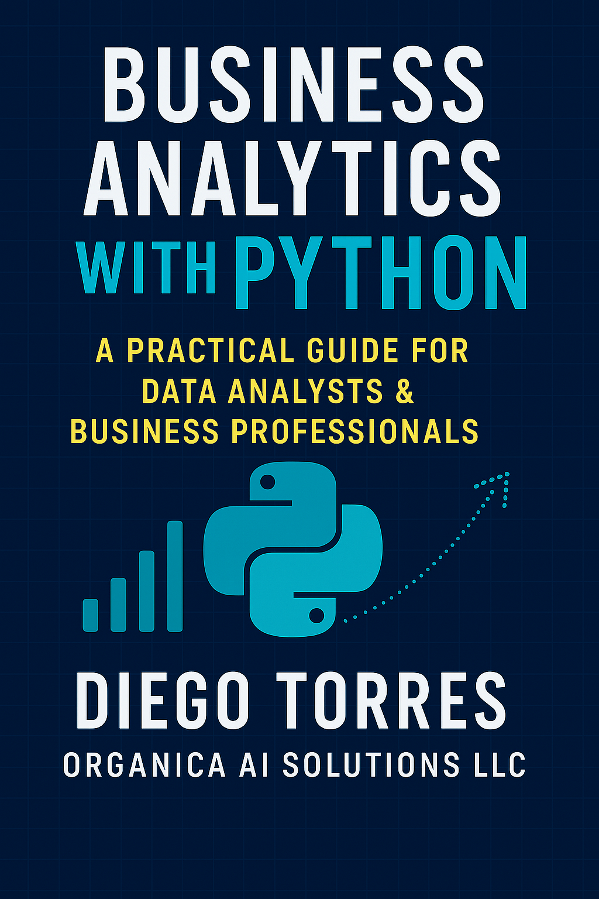

# Business Analytics in Retail: A Practical Guide

<p align="center">
  
</p>

A comprehensive guide to building modern retail analytics solutions, complete with interactive dashboards and data-driven insights.

## 📚 Book Overview

This book provides a practical approach to implementing retail analytics using Python, Flask, and modern JavaScript. Through hands-on examples and real-world scenarios, you'll learn how to:

- Build interactive dashboards for retail analytics
- Process and analyze retail data effectively
- Create RESTful APIs with Flask
- Implement modern frontend solutions
- Deploy production-ready analytics applications

## 📖 Book Structure

### Part I: Foundations
- Introduction to Retail Analytics
- Understanding the Retail Data Landscape
- Setting Up Your Development Environment
- Data Processing and Analysis Fundamentals

### Part II: Building the Analytics Platform
- Designing the Backend Architecture
- Creating RESTful APIs with Flask
- Frontend Development with Modern JavaScript
- Interactive Visualizations with Chart.js

### Part III: Advanced Topics and Implementation
- Real-time Analytics and Dashboard Updates
- Deployment and Production Considerations

## 🛠 Tech Stack

### Backend
- Python with Flask
- SQLite database
- RESTful API architecture
- JSON response format

### Frontend
- Vanilla JavaScript
- Chart.js for visualizations
- Bootstrap for styling
- Modern ES6+ features

## 🚀 Getting Started

1. Clone the repository:
   ```bash
   git clone https://github.com/yourusername/business-analytics-retail.git
   cd business-analytics-retail
   ```

2. Set up the backend:
   ```bash
   cd backend
   python -m venv venv
   source venv/bin/activate  # On Windows: venv\Scripts\activate
   pip install -r requirements.txt
   python src/app.py
   ```

3. Set up the frontend:
   ```bash
   cd frontend
   npm install
   npm run dev
   ```

4. Access the application:
   - Frontend: http://localhost:3000
   - Backend API: http://localhost:5001
   - API Documentation: http://localhost:5001/api/docs

## 📊 Features

- **Sales Analytics**
  - Real-time sales data visualization
  - Period-over-period comparisons
  - Store performance metrics
  - Department-level analysis

- **Business Intelligence**
  - Key Performance Indicators (KPIs)
  - Store performance rankings
  - Inventory analytics
  - Trend analysis

## 🔧 Development

### Project Structure
```
.
├── backend/
│   ├── src/
│   │   ├── controllers/
│   │   ├── routes/
│   │   ├── database/
│   │   └── utils/
│   └── requirements.txt
├── frontend/
│   ├── src/
│   │   ├── components/
│   │   ├── services/
│   │   └── styles/
│   └── package.json
└── book/
    ├── chapters/
    ├── images/
    └── manuscript.md
```

### Running Tests
```bash
# Backend tests
cd backend
pytest

# Frontend tests
cd frontend
npm test
```

## 📝 License

This project is licensed under the MIT License - see the [LICENSE](LICENSE) file for details.

## 🤝 Contributing

Contributions are welcome! Please feel free to submit a Pull Request. For major changes, please open an issue first to discuss what you would like to change.

## 📬 Contact

- Author: Diego Torres
- Organization: Organica AI Solutions
- Website: [https://organicaai.com](https://www.organicaai.com)
- Email: contact@organica.ai